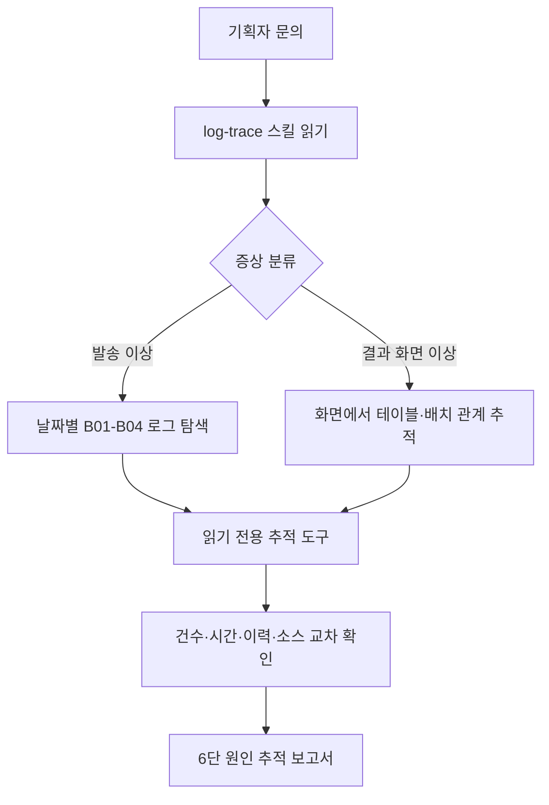
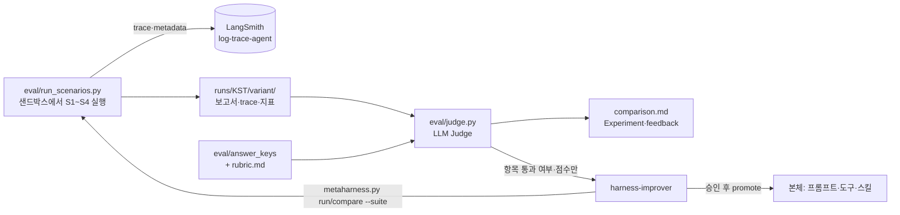

# 로그 기반 원인 추적 에이전트

## 목적

캠페인 채널 발송·성과 집계 문의를 받아, 로그에서 시작해 배치·테이블·소스와 변경·장애 이력까지 거슬러 확인하는 에이전트 PoC입니다. 실제 업무 소스·로그·개인정보는 넣지 않았고, 전부 가상인 목업 데이터로 설계와 평가 흐름을 검증합니다.

에이전트는 사실과 추정을 구분해 원인 후보와 근거를 정리합니다. 최종 판단과 운영 조치는 담당자가 하며, 추적 도구는 읽기 전용입니다.

이 저장소는 에이전트를 세 단계로 고도화합니다.

1. **Observation**: LangSmith trace에 단계별 입출력·토큰·latency·비용·도구 호출을 남기고, 작업 방식 지표를 뽑습니다.
2. **평가 세트와 LLM Judge**: S1~S4 질문과 정답 기준으로 항목별 True/False, 종합 점수, pairwise 비교를 자동화합니다.
3. **Meta-Harness**: 개선 에이전트가 log-trace 에이전트를 격리 복제본으로 실행·수정·비교하고, 확실히 나은 변경만 승인을 받아 반영합니다.

## 에이전트 흐름



각 시나리오는 새 대화에서 실행합니다. 에이전트는 `log-trace` 절차에 따라 로그를 검색하고, 목업 조회 도구로 캠페인·발송 이력·모듈 관계·소스·변경·장애 이력을 확인합니다. 보고서에는 근거 위치와 `[확인]`·`[추정]`을 표시하고 개인정보를 마스킹합니다.

## 평가·개선 흐름



## 에이전트 구성

### 로그 추적 에이전트 (`deepagent` 그래프)

[langchain-deepagents.py](langchain-deepagents.py)는 모델 초기화, 셸이 제한된 workspace 백엔드, 시스템 프롬프트, 스킬·메모리 등록과 그래프 생성을 담당합니다. 로그 추적 에이전트에는 추적 도구만 등록하며, 저장소에 남아 있는 Gateway·채널 커넥터는 이 그래프에 연결하지 않습니다. trace에는 `role=agent`, `variant`, `model` 메타데이터가 붙습니다.

- [log-trace 스킬](workspace_seed/skills/log-trace/SKILL.md): 발송 흐름과 결과 흐름의 추적 순서, 도구 선택, 근거 표기, 보고서 출력 규칙(파일 저장은 하지 않음)
- `workspace_seed/skills/log-trace/references/`: 발송·결과 흐름, 일반 이슈, 개인정보 마스킹 참고 자료
- `workspace_seed/skills/log-trace/templates/report_template.md`: 6단 분석 보고서 양식
- [workspace_seed/AGENTS.md](workspace_seed/AGENTS.md): 한국어 보고서 선호, 프로젝트 힌트와 반복해서 발견한 함정

실행할 때 `workspace_seed/skills/`와 `workspace_seed/AGENTS.md`가 `workspace/`에 반영되고, 실행 중 바뀐 내용은 seed로 다시 동기화됩니다.

### 개선 에이전트 (`harness-improver` 그래프)

[harness_improver.py](harness_improver.py)는 log-trace 에이전트를 [meta-harness 스킬](workspace_seed/skills/meta-harness/SKILL.md) 절차로 개선합니다. 실행 주체를 log-trace 에이전트와 분리했기 때문에(방식 A) 로그 분석 프롬프트에 자기개선 지시가 섞이지 않습니다.

- 개선 에이전트는 자기 workspace `workspace_improver/`만 쓰고, meta-harness 스킬만 봅니다.
- 셸은 `date`와 `python skills/meta-harness/metaharness.py`만 실행할 수 있습니다.
- 정답은 읽을 수 없습니다. 채점 결과는 항목 통과 여부·점수·pairwise 승패·trace 지표로만 받습니다.
- trace는 `role=improver`로 남고, 개선 에이전트가 돌린 복제본은 `role=agent`, `variant=v1` 등으로 남습니다.

### 조회 도구

[trace_tools.py](trace_tools.py)는 다음 읽기 전용 도구 10개를 제공합니다.

- `query_send_history`, `query_campaign`, `query_perf_summary`, `query_table_status`
- `get_batch_jobs`, `get_module_relations`
- `read_source`, `search_source`
- `search_incident_history`, `get_change_log`

모든 목업 파일 접근은 `MockRepository` 한 곳을 거칩니다. 이 저장소는 `mock_data/` 경로 밖을 허용하지 않고 `eval/`을 읽지 않습니다. VDI에 적용할 때는 `MockRepository` 구현을 실제 읽기 전용 DB·소스 인덱스로 바꾸되, 도구 이름과 인자 계약은 유지합니다. 이 지점이 교체 경계입니다.

### 정답 격리

| 경로 | 막는 방법 |
|---|---|
| 파일 도구 | `virtual_mode=True`가 workspace 밖(`..`, 절대경로)을 거부 |
| `execute` 셸 | [shell_policy.py](shell_policy.py)가 `date`만 허용하고 셸 메타문자(`; & \| < > $` 백틱 `\`)를 거부. 개선 에이전트만 meta-harness CLI 추가 허용 |
| 평가 실행 | `eval/run_scenarios.py`가 레포 밖 임시 샌드박스에서 에이전트를 실행. 샌드박스에는 `eval/`·`runs/`·`.env`·`.git`을 복사하지 않음 |
| meta-harness | variant 복제본에서 `eval/`·`runs/` 제외. CLI 입력 파일은 `eval/`·`runs/` 거부, `show`는 실행 폴더 밖 거부. 개선 에이전트에게는 Judge 근거를 주지 않음 |
| Judge | answer_key는 Judge 프롬프트에만 전달 |

## Observation (LangSmith)

`.env`에 다음을 넣으면 모든 실행이 LangSmith 프로젝트 `log-trace-agent`에 기록됩니다. 프로젝트와 엔드포인트는 환경변수로만 정합니다. 키가 없으면 경고만 출력하고 트레이싱 없이 실행합니다.

```env
LANGSMITH_TRACING=true
LANGSMITH_API_KEY=
LANGSMITH_PROJECT=log-trace-agent
LANGSMITH_ENDPOINT=https://api.smith.langchain.com
```

- 실행 스크립트가 trace에 `scenario_id`, `variant`, `run_set`(KST), `model`, `role` 메타데이터와 태그를 붙입니다. 에이전트는 자기 시나리오 ID를 모릅니다.
- [eval/trace_metrics.py](eval/trace_metrics.py)가 trace에서 작업 방식 지표를 뽑습니다. 총 단계, 도구별 호출, 같은 도구·인자 반복, 실패 후 같은 재시도, 토큰, latency, 비용, SKILL 선독, eval 접근 시도, 쓰기성 명령입니다. 실행 중 콜백 기록, LangSmith trace, 대화 메시지 세 출처를 모두 같은 지표로 바꿉니다.

## 평가 세트와 LLM Judge

평가 세트는 기존 S1~S4([eval/scenarios.json](eval/scenarios.json), `eval/answer_keys/`)를 그대로 씁니다. 해석이 모호한 판정 기준은 answer_key를 고치지 않고 [eval/rubric.md](eval/rubric.md)에 보완했습니다.

[eval/judge.py](eval/judge.py)는 LLM-as-a-Judge 세 가지 형태를 구현합니다.

- **항목별 True/False**: 판정표 9개 항목마다 보고서 인용 근거와 이유를 남깁니다.
- **종합 점수**: 1~5점과 이유
- **Pairwise**: 같은 시나리오의 두 보고서를 A/B 순서를 바꿔 두 번 비교하고, 엇갈리면 무승부로 봅니다.

Judge는 temperature 0과 JSON 스키마 structured output을 씁니다. 모델은 `JUDGE_MODEL_NAME`(가능하면 에이전트와 다른 모델)으로 정하며, 비우면 에이전트 모델을 씁니다. LangSmith 키가 있으면 Dataset `log-trace-eval-s1-s4`를 갱신하고 `evaluate()`로 Experiment `<variant>-<run_set>`을 남기며, 에이전트 trace에도 판정 feedback을 붙입니다.

**baseline-v0 기준 점수** ([runs/20261001-152522/baseline/comparison.md](runs/20261001-152522/baseline/comparison.md))

| | S1 | S2 | S3 | S4 |
|---|---|---|---|---|
| 통과 항목 | 9/9 | 8/9 | 6/9 | 9/9 |
| 종합 점수 | 5 | 4 | 2 | 5 |

**Meta-Harness 사이클 1**: 개선 에이전트가 S2 영향 범위 실패를 진단하고 log-trace 스킬 한 줄을 고친 v1을 만들었다. 결과는 S2 개선 없음, S3 항목 회귀, pairwise 엇갈림이라 **무승부(promote 안 함)** 였다. v1 반복 실행은 너무 오래 걸려 1회차에서 끊었다. 실행 시간 개선 방향은 [docs/improvement_log.md](docs/improvement_log.md)에 정리했다.

## 실행 명령

```bash
uv sync
uv run python -m unittest discover -s tests          # 테스트
uv run python mock_data/check_consistency.py         # 목업 정합성

# 1) S1~S4 헤드리스 실행 → runs/<KST>/<variant>/
uv run python eval/run_scenarios.py run --variant baseline --scenarios all

# 2) LLM Judge 채점 → comparison.md, LangSmith Experiment
uv run python eval/judge.py score runs/<KST>/baseline

# 3) 두 실행 비교 (항목 표·pairwise·trace 지표)
uv run python eval/judge.py compare --a runs/20261001-152522/baseline --b runs/<KST>/<variant>

# 4) 개선 에이전트 (Studio 의 harness-improver 그래프 또는 헤드리스)
uv run python harness_improver.py "meta-harness 로 log-trace 에이전트를 S1~S4 기준으로 개선해줘"

# 서버 + Studio (deepagent, harness-improver 그래프)
LANGGRAPH_TUNNEL=0 uv run python langchain-deepagents.py
```

### Studio에서 직접 실행한 보고서를 baseline-v0과 비교하기

1. LangSmith Studio의 `deepagent` 그래프에서 S1~S4 질문을 각각 **New Thread**로 실행합니다.
2. 대화마다 thread ID로 보고서와 trace 지표를 저장합니다. 첫 시나리오에만 `--new`를 붙입니다.

   ```bash
   uv run python eval/run_scenarios.py save S1 --thread-id <id> --variant studio --new
   uv run python eval/run_scenarios.py save S2 --thread-id <id> --variant studio
   uv run python eval/run_scenarios.py save S3 --thread-id <id> --variant studio
   uv run python eval/run_scenarios.py save S4 --thread-id <id> --variant studio
   ```

3. Judge로 채점하고 baseline-v0 기준 점수와 비교합니다.

   ```bash
   uv run python eval/judge.py score runs/<KST>/studio
   uv run python eval/judge.py compare --a runs/20261001-152522/baseline --b runs/<KST>/studio
   ```

   결과는 `runs/<KST>/studio/compare_vs_baseline@20261001-152522.md`에 저장됩니다. 시나리오×항목 표(A → B), pairwise 결과, trace 지표 비교가 들어 있습니다.

준비, LangSmith 연결 확인, 판정 기준, 개선 에이전트 사용법은 [로그 추적 테스트 가이드](docs/log-trace-test-guide.md)에 정리했습니다. 개선 사이클 기록은 [docs/improvement_log.md](docs/improvement_log.md), 고도화 보고서 초안은 [docs/improvement_report.md](docs/improvement_report.md)에 있습니다.

## 저장소 구조

```text
docs/
  agent_plan.md                 기획과 범위
  mock_data_spec.md             목업 데이터 설계
  log-trace-test-guide.md       실행·평가·개선 가이드
  improvement_log.md            meta-harness 사이클 기록
  improvement_report.md         에이전트 고도화 보고서 초안
mock_data/
  generate.py                   고정 시드 데이터·로그·가상 소스 생성
  check_consistency.py          건수·로그·정답 근거 정합성 검사
  db/ graph/ source/ logs/      조회 데이터, 관계, 가상 Java, 배치 로그
eval/
  scenarios.json                S1~S4 기획자 문의
  answer_keys/                  평가용 정답; 에이전트 접근 금지
  rubric.md                     Judge 판정 해석 기준
  run_scenarios.py              샌드박스 헤드리스 실행·Studio 저장·작업 방식 지표
  trace_metrics.py              trace → 작업 방식 지표
  judge.py                      LLM Judge·Dataset·Experiment·비교
  baseline.json                 baseline-v0 기준 점수 위치
runs/<KST>/<variant>/           보고서, trace, 지표, 판정표
scripts/load_logs.sh            로그를 workspace/input/logs/로 적재(Studio용)
observability.py                LangSmith 설정과 trace 메타데이터
langchain-deepagents.py         로그 추적 에이전트(deepagent 그래프)
harness_improver.py             개선 에이전트(harness-improver 그래프)
trace_tools.py                  MockRepository와 읽기 전용 조회 도구
shell_policy.py                 execute 셸 허용 목록(정답 유출 차단)
connectors.py                   기존 커넥터 코드와 추적 도구 등록부
tests/                          추적 도구·셸 정책·실행·지표·Judge·meta-harness 테스트
workspace_seed/
  AGENTS.md                     에이전트 작업 힌트와 선호
  skills/log-trace/             로그 추적 절차 스킬
  skills/meta-harness/          자기개선 스킬과 CLI(metaharness.py)
workspace/                      로그 추적 에이전트 작업 공간 (Git 제외)
workspace_improver/             개선 에이전트 작업 공간 (Git 제외)
_archive/                       사용하지 않는 문서·예제와 진입 파일 원본
```

## VDI 적용 경계

Codespace에서는 가상 데이터와 목업 저장소만 사용합니다. VDI에서는 업무 데이터를 반입하지 않고, 승인된 내부 환경에서 로그·DB·소스 조회 권한을 연결해 `MockRepository` 구현을 교체합니다. 외부 실습 환경에 실제 데이터나 개인정보를 넣지 않습니다. LangSmith는 외부 SaaS이므로 VDI에서는 사내 승인 범위에 따라 트레이싱을 끄거나(`LANGSMITH_TRACING=false`) 자체 호스팅 엔드포인트(`LANGSMITH_ENDPOINT`)로 바꿉니다.
