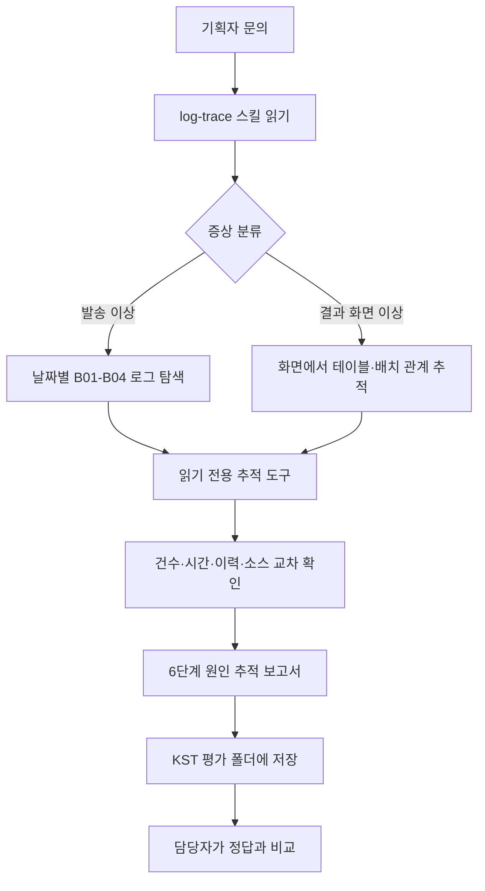

# 로그 기반 원인 추적 에이전트

## 목적

캠페인 채널 발송·성과 집계 문의를 로그에서 시작해 배치, 테이블, 소스와 변경·장애 이력까지 거슬러 확인하는 에이전트 PoC입니다. 실제 업무 소스·로그·개인정보는 포함하지 않고, 전부 가상인 목업 데이터로 설계와 평가 흐름을 검증합니다.

에이전트는 사실과 추정을 구분해 원인 후보 및 근거를 정리합니다. 최종 판단과 운영 조치는 담당자의 몫이며, 추적 도구는 읽기 전용입니다.

## 에이전트 흐름



각 시나리오는 새 대화에서 실행합니다. 에이전트는 `log-trace` 절차에 따라 로그를 검색하고, 목업 조회 도구로 캠페인·발송 이력·모듈 관계·소스·변경·장애 이력을 확인합니다. 보고서에는 근거 위치와 `[확인]`·`[추정]`을 표시하고 개인정보를 마스킹합니다.

## 에이전트 구성

### 에이전트 진입점

[langchain-deepagents.py](langchain-deepagents.py)는 모델 초기화, workspace 백엔드, 시스템 프롬프트, 스킬·메모리 등록과 LangGraph의 `deepagent` 그래프 생성을 담당합니다. 로그 추적 에이전트에는 추적 도구만 등록하며, 저장소에 남아 있는 Gateway·채널 커넥터는 이 그래프에 연결하지 않습니다.

### 스킬과 메모리

- [log-trace 스킬](workspace_seed/skills/log-trace/SKILL.md): 발송 흐름과 결과 흐름의 추적 순서, 도구 선택, 근거 표기, 자동 보고서 저장 규칙
- `workspace_seed/skills/log-trace/references/`: 발송·결과 흐름, 일반 이슈, 개인정보 마스킹 참고 자료
- `workspace_seed/skills/log-trace/templates/report_template.md`: 6단 분석 보고서 양식
- `workspace_seed/skills/meta-harness/`: 프로젝트에 유지하는 하네스 검증 스킬
- [workspace_seed/AGENTS.md](workspace_seed/AGENTS.md): 한국어 보고서 선호, 프로젝트 힌트와 반복해서 발견한 함정

실행 시 `workspace_seed/skills/`와 `workspace_seed/AGENTS.md`가 `workspace/`에 반영되며, runtime 변경은 seed로 동기화됩니다.

### 조회 도구

[trace_tools.py](trace_tools.py)는 다음 읽기 전용 도구 10개를 제공합니다.

- `query_send_history`, `query_campaign`, `query_perf_summary`, `query_table_status`
- `get_batch_jobs`, `get_module_relations`
- `read_source`, `search_source`
- `search_incident_history`, `get_change_log`

모든 목업 파일 접근은 `MockRepository` 한 곳을 통합니다. 이 저장소는 `mock_data/` 경로 밖을 허용하지 않고 `eval/`을 읽지 않습니다. VDI 적용 시 `MockRepository` 구현을 실제 읽기 전용 DB·소스 인덱스로 바꾸되 도구 이름과 인자 계약은 유지하는 것이 교체 경계입니다.

## 저장소 구조

```text
docs/
  agent_plan.md                 기획과 범위
  mock_data_spec.md             목업 데이터 설계
  log-trace-test-guide.md       실행·평가 가이드
mock_data/
  generate.py                   고정 시드 데이터·로그·가상 소스 생성
  check_consistency.py          건수·로그·정답 근거 정합성 검사
  db/ graph/ source/ logs/      조회 데이터, 관계, 가상 Java, 배치 로그
eval/
  scenarios.json               S1~S4 기획자 문의
  answer_keys/                  평가용 정답; 에이전트 접근 금지
scripts/load_logs.sh           로그를 workspace/input/logs/로 적재
trace_tools.py                 MockRepository와 읽기 전용 조회 도구
connectors.py                  기존 커넥터 코드와 추적 도구 등록부
tests/test_trace_tools.py       추적 도구 테스트
workspace_seed/
  AGENTS.md                     에이전트 작업 힌트와 선호
  skills/                       Git으로 관리하는 스킬
workspace/
  input/logs/                   에이전트가 읽는 입력 로그
  runs/<KST timestamp>/         S1~S4 보고서와 comparison.md (Git 제외)
_archive/                       사용하지 않는 문서·예제와 진입 파일 원본
```

## 평가 흐름

S1이 `runs/.current-session`에 새 KST timestamp 폴더를 지정합니다. 같은 평가 세트의 S2~S4는 그 폴더에 이어 저장되며, 네 보고서가 모이면 평가자가 `eval/answer_keys/`와 대조해 `comparison.md`를 기록합니다. 보고서 경로를 매번 지정할 필요는 없습니다. `workspace/`는 Git 제외 영역이므로 실행 보고서를 저장소에 보존할 때는 선택한 결과 폴더를 저장소 루트의 `runs/`로 복사해 검토합니다.

테스트 준비, LangSmith 연결, S1~S4 판정 기준은 [로그 추적 테스트 가이드](docs/log-trace-test-guide.md)에 정리되어 있습니다.

## VDI 적용 경계

Codespace에서는 가상 데이터와 목업 저장소만 사용합니다. VDI에서는 업무 데이터를 반입하는 대신, 승인된 내부 환경에서 로그·DB·소스 조회 권한을 연결하고 `MockRepository` 구현을 교체합니다. 외부 실습 환경에 실제 데이터나 개인정보를 넣지 않습니다.
