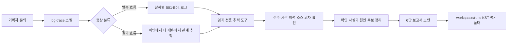

# Agent Build and Evaluation Practice

## 프로젝트 개요

이 저장소는 캠페인 채널 발송과 성과 집계 문의를 로그에서 시작해 배치·테이블·소스·과거 이력까지 추적하는 에이전트 PoC다. Codespace에서는 **모두 가상인 목업 데이터**로 설계와 동작을 검증한다. 실제 업무 소스·로그·개인정보는 포함하지 않으며, 검증된 에이전트 구조와 도구 인터페이스를 이후 VDI의 실제 읽기 전용 조회 환경으로 옮기는 것을 목표로 한다.

에이전트는 원인 후보와 근거를 정리하는 보조자다. 조회 도구는 읽기 전용이며, 최종 원인 판단과 운영 조치는 담당자가 한다.

## 에이전트 워크플로



1. 문의의 캠페인·날짜·증상을 정리하고 발송 흐름 또는 결과 흐름으로 나눈다.
2. 로그는 workspace의 `/input/logs/`에서 검색하고 필요한 줄만 읽는다.
3. 캠페인·발송 이력·관계·소스·변경·장애 이력은 `trace_tools.py`의 조회 도구로 교차 확인한다.
4. 확인된 사실과 추정을 구분하고, 근거 강도 순으로 원인 후보를 정리한다.
5. 결과는 여섯 부분의 보고서 초안으로 작성한다. 원인 확정과 운영 조치는 담당자가 한다.
6. S1이 시작하는 KST timestamp 폴더에 S1~S4 보고서를 자동 저장한다. 정답 비교는 평가자가 수행하고 결과는 `comparison.md`에 보관한다.

## 주요 구성

```text
langchain-deepagents.py       모델·workspace 설정, 시스템 프롬프트, LangGraph 진입점
trace_tools.py                읽기 전용 추적 도구와 교체 가능한 MockRepository
connectors.py                 기존 외부 커넥터 코드; 로그 추적 그래프에는 등록하지 않음
mock_data/                    결정적 목업 생성기, 조회 데이터, 로그, 가상 Java 소스
eval/                         S1-S4 문의와 평가용 정답 기준; 에이전트 workspace 밖에 둠
scripts/load_logs.sh          목업 로그를 workspace/input/logs로 적재
tests/                        읽기 전용 추적 도구 검증
workspace_seed/skills/        Git으로 관리하는 log-trace 및 meta-harness 스킬
workspace/                    실행 workspace, 입력 로그, 평가 결과 (Git 제외)
docs/                         기획서, 목업 설계서, 실행·평가 가이드
_archive/                     사용하지 않는 문서·예제와 원본 진입 파일 보관
```

`trace_tools.py`는 `mock_data/`만 읽고 `eval/`에는 접근하지 않는다. VDI 적용 시 `MockRepository`만 실제 읽기 전용 DB·소스 조회 구현으로 교체하고 도구의 이름과 입출력 계약을 유지한다.

테스트 실행 절차는 [로그 추적 테스트 가이드](docs/log-trace-test-guide.md)를 참고한다.

## Codespaces에서 실행하기

> **전체 흐름** Codespace 만들기 → `.env` 설정 → 설치·실행 → `2024` 포트 공개 → LangSmith Studio 연결 → 채팅
>
> 아래 이미지는 이해를 돕기 위한 예시 화면입니다. 실제 화면은 서비스 업데이트에 따라 조금 다를 수 있습니다.

1. GitHub 저장소 우측 상단의 초록색 **Code** 버튼을 누르고 **Codespaces** 탭에서 **Create codespace on main**을 눌러 Codespace를 만듭니다.

   

2. 생성된 Codespace를 열고 VS Code 화면이 나타날 때까지 기다립니다. 왼쪽 아래에 **Codespaces: …** 표시가 보이면 준비가 끝난 것입니다.

   

3. 왼쪽 탐색기에서 `.env.example`을 복제해 `.env`로 이름을 바꿉니다. `.env`를 열고 `OPENAI_API_KEY`에 OpenRouter API 키를 입력한 뒤 저장합니다.

   

   `.env`는 로컬 비밀 설정 파일이므로 커밋하거나 다른 사람과 공유하지 마세요.

4. 하단 패널에서 **Terminal**을 열고 의존성을 설치합니다.

   ```bash
   uv sync
   ```

   

5. 설치가 끝나면 메인 스크립트를 실행합니다.

   ```bash
   LANGGRAPH_TUNNEL=0 uv run python langchain-deepagents.py
   ```

   이 명령은 Cloudflare tunnel 없이 GitHub Codespaces의 2024 포트만 사용합니다. 이미 서버가 실행 중이면 다시 실행하지 말고, 실행한 터미널은 Studio를 사용하는 동안 열어 둡니다. 서버를 종료하려면 `Ctrl+C`를 누릅니다.

   

6. VS Code 우측 하단에 포트 포워딩 요청이 뜨면 허용합니다. 하단 **PORTS** 탭에서 `2024` 포트가 보이는지 확인하고, 포트 공개 범위를 **Public**으로 설정합니다(`2024` 행 우클릭 → **Port Visibility** → **Public**). 포트의 **Forwarded Address**를 복사합니다.

   

7. 새 브라우저 탭에서 [LangSmith](https://smith.langchain.com/)에 접속해 로그인합니다.
8. 왼쪽 탐색 메뉴에서 **Studio**로 이동한 뒤 **Configure connection**을 누릅니다.

   

9. **Base URL**에 PORTS 탭에서 복사한 `2024` 포트의 **Forwarded Address**를 붙여 넣습니다. 주소 끝에 `/`나 `/ok`는 붙이지 않습니다.

   

10. **Domain not allowed** 경고가 나타나면 **Add to allowed domains**를 눌러 허용합니다.

    

11. 연결되면 그래프 UI가 나타납니다. `deepagent` 그래프를 선택하고, 좌측 상단의 **Graph** 토글을 **Chat**으로 바꿔 메시지를 보내 응답을 확인합니다.

    

    

## 필수 설정

로그 추적 에이전트에는 `.env`의 `OPENAI_API_KEY`가 필수입니다. 모델명과 OpenAI 호환 API 주소는 선택적으로 `MODEL_NAME`, `MODEL_BASE_URL`로 지정할 수 있습니다. `.env`는 커밋하거나 공유하지 마세요. 예시는 [`.env.example`](.env.example)을 참고하세요. 저장소에 남아 있는 Gateway·Slack·Telegram·이메일 커넥터 코드는 별도 레거시 기능이며, 이 로그 추적 그래프에는 연결하지 않습니다.

## 로그 추적 에이전트 테스트

목업 로그를 적재하고 LangSmith에서 S1~S4 시나리오를 실행·판정하려면 [로그 추적 테스트 가이드](docs/log-trace-test-guide.md)를 참고하세요.
